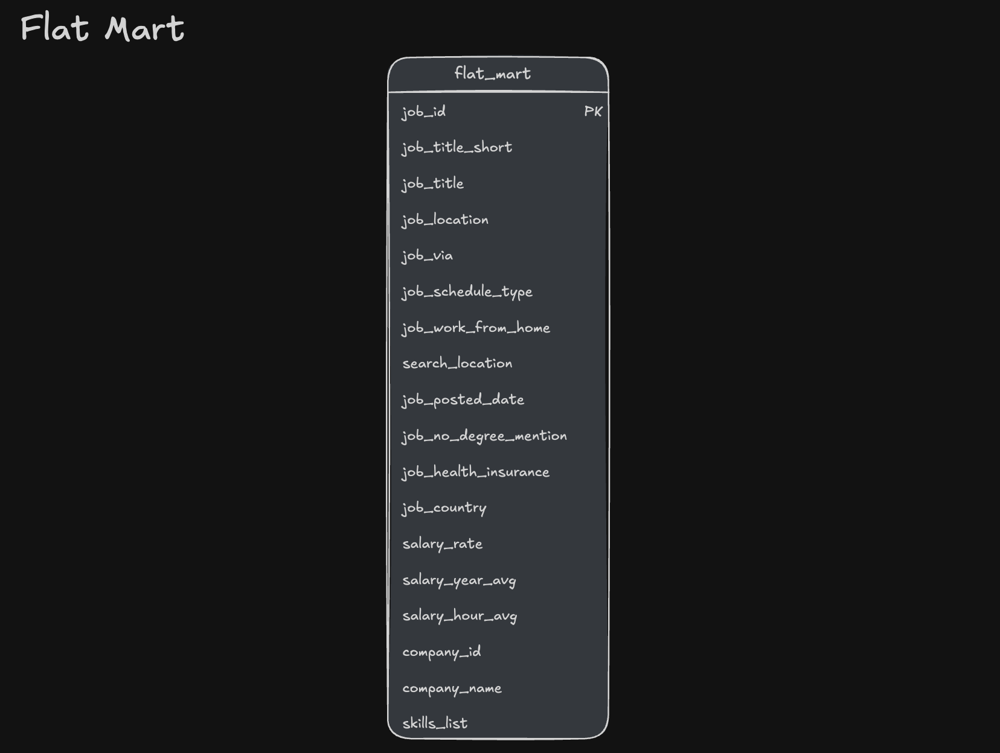

# Data Warehouse and Mart Build with DuckDB

This project implements an end-to-end SQL pipeline that loads job-posting data from Google Cloud Storage into a normalized DuckDB warehouse and then builds three purpose-specific analytical marts.


## Executive Summary

- **Warehouse layer:** Creates a job-postings fact table, company and skills dimensions, and a many-to-many job-skill bridge.
- **Source loading:** Reads four CSV files directly from Google Cloud Storage with explicit target-column mappings.
- **Analytical marts:** Builds a denormalized Flat Mart, a dimensional monthly Skills Mart, and a Priority Mart.
- **Incremental pattern:** Uses DuckDB `MERGE` to synchronize the Priority Mart snapshot through updates, inserts, and deletions.
- **Orchestration:** Executes the dependent SQL files in order through a single DuckDB CLI master script.
- **Validation:** Includes table counts, sample rows, and aggregated result checks at the relevant pipeline stages.

The project demonstrates the transition from source ingestion to warehouse modeling, analytical serving structures, and controlled synchronization logic. It is a portfolio pipeline rather than a deployed production service; scheduling, monitoring, and automated recovery are outside the present scope.

## Problem and Context

The source data consists of separate job-posting, company, skill, and job-skill CSV files. Querying these files independently would require analysts to repeatedly recreate joins, transformations, and aggregation logic.

The project addresses this by creating:

1. a normalized warehouse as the reusable source of truth;
2. a Flat Mart for convenient record-level exploration;
3. a Skills Mart for stable monthly skill-demand analysis; and
4. a Priority Mart for operational tracking of selected job roles.

This separation keeps the reusable source model distinct from consumer-oriented tables with different grains and use cases.

## Tech Stack

- **DuckDB** — analytical database, CSV reader, and SQL execution engine
- **MotherDuck** — optional cloud execution target
- **SQL** — DDL, DML, transformations, aggregation, and synchronization
- **Google Cloud Storage** — storage location for the four source CSV files
- **DuckDB CLI** — file orchestration through `.read`
- **VS Code** — SQL development environment
- **Git and GitHub** — version control and project documentation

## Repository Structure

```text
2.2_Building_DWH/
├── 01_Table_Creation_DWH.sql
├── 02_Schema_Load_DWH.sql
├── 03_Flat_Mart_Creation_DWH.sql
├── 04_Skills_Mart_Creation_DWH.sql
├── 05_Priority_Mart_Creation_DWH.sql
├── 05b_Priority_Roles_Updates_DWH.sql
├── 06_Priority_Mart_Update_DWH.sql
├── Marts_Build_Pipeline.sql
└── README.md
```

| File | Responsibility |
|---|---|
| [`01_Table_Creation_DWH.sql`](./01_Table_Creation_DWH.sql) | Drops and recreates the four warehouse tables with keys and relationships |
| [`02_Schema_Load_DWH.sql`](./02_Schema_Load_DWH.sql) | Loads the four cloud CSV sources and validates counts and sample records |
| [`03_Flat_Mart_Creation_DWH.sql`](./03_Flat_Mart_Creation_DWH.sql) | Builds the denormalized `flat_mart.job_postings` table |
| [`04_Skills_Mart_Creation_DWH.sql`](./04_Skills_Mart_Creation_DWH.sql) | Builds the monthly dimensional Skills Mart |
| [`05_Priority_Mart_Creation_DWH.sql`](./05_Priority_Mart_Creation_DWH.sql) | Creates priority-role reference data and the initial job snapshot |
| [`05b_Priority_Roles_Updates_DWH.sql`](./05b_Priority_Roles_Updates_DWH.sql) | Applies controlled reference-data changes for testing the synchronization step |
| [`06_Priority_Mart_Update_DWH.sql`](./06_Priority_Mart_Update_DWH.sql) | Synchronizes the Priority Mart snapshot with a temporary source table through `MERGE` |
| [`Marts_Build_Pipeline.sql`](./Marts_Build_Pipeline.sql) | Executes the complete pipeline in dependency order |

## Pipeline Architecture

The build order is:

```text
Google Cloud Storage CSVs
        │
        ▼
DuckDB warehouse tables
        │
        ├──► Flat Mart
        ├──► Skills Mart
        └──► Priority Mart ──► test change ──► MERGE synchronization
```

The master pipeline executes the following sequence:

```sql
.read 01_Table_Creation_DWH.sql
.read 02_Schema_Load_DWH.sql
.read 03_Flat_Mart_Creation_DWH.sql
.read 04_Skills_Mart_Creation_DWH.sql
.read 05_Priority_Mart_Creation_DWH.sql
.read 05b_Priority_Roles_Updates_DWH.sql
.read 06_Priority_Mart_Update_DWH.sql
```

Because these paths are relative, the master file should be run from inside `2_Projects/2.2_Building_DWH`.

## 1. Warehouse Layer

[`01_Table_Creation_DWH.sql`](./01_Table_Creation_DWH.sql) creates four related tables:

- `company_dim` — one row per company;
- `skills_dim` — one row per skill and skill type;
- `job_postings_fact` — one row per job posting; and
- `skills_job_dim` — bridge table connecting jobs and skills through the composite key `(skill_id, job_id)`.


The foreign keys express the intended relationships:

- `job_postings_fact.company_id` → `company_dim.company_id`
- `skills_job_dim.skill_id` → `skills_dim.skill_id`
- `skills_job_dim.job_id` → `job_postings_fact.job_id`

The diagram provides a conceptual view of the source model. The DDL file is the authoritative specification for the exact set of columns implemented in this project.

## 2. Source Loading and Validation

[`02_Schema_Load_DWH.sql`](./02_Schema_Load_DWH.sql) loads:

- `company_dim.csv`
- `skills_dim.csv`
- `job_postings_fact.csv`
- `skills_job_dim.csv`

Each file is read directly from `https://storage.googleapis.com/sql_de/` through DuckDB's `read_csv(..., AUTO_DETECT=TRUE)` function. The `INSERT INTO ... SELECT` statements use explicit target columns so that the mapping remains visible and reviewable.

After loading, the script returns the record count for every warehouse table and displays the first five rows of each table. These checks confirm that records reached every target, but they are validation queries rather than a complete automated data-quality test suite.

## 3. Flat Mart

[`03_Flat_Mart_Creation_DWH.sql`](./03_Flat_Mart_Creation_DWH.sql) recreates the `flat_mart` schema and builds `flat_mart.job_postings` through CTAS.



**Purpose:** Provide a convenient record-level table for ad-hoc analysis without requiring consumers to reproduce the warehouse joins.

**Grain:** One row per `job_id`.

**Implementation details:**

- job-posting attributes are selected from `job_postings_fact`;
- `company_name` is joined from `company_dim`;
- skills and their types are nested with `ARRAY_AGG(STRUCT_PACK(...))` in `skills_and_type`; and
- `LEFT JOIN` preserves the job-posting side when related company or skill rows are missing.

The script validates the result with a row count and a five-row sample.

## 4. Skills Mart

[`04_Skills_Mart_Creation_DWH.sql`](./04_Skills_Mart_Creation_DWH.sql) recreates the `skills_mart` schema and builds:

- `skills_mart.dim_skills`
- `skills_mart.dim_date_month`
- `skills_mart.fact_skill_demand_monthly`


**Purpose:** Support time-series analysis of skill demand and selected job-posting characteristics.

**Fact-table grain:**

```text
skill_id + month_start_date + job_title_short
```

**Additive measures:**

- `postings_count`
- `remote_postings_count`
- `health_insurance_postings_count`
- `no_degree_mention_count`

The pipeline converts Boolean flags to integer indicators in a CTE and then aggregates them with `COUNT()` and `SUM()`. The date dimension derives year, month, quarter, quarter label, and year-quarter from `job_posted_date` using `DATE_TRUNC` and `EXTRACT`.

Because the fact table stores counts rather than precomputed percentages, the measures can be safely re-aggregated across compatible dimensions before ratios are calculated by a downstream consumer.

## 5. Priority Mart

The Priority Mart separates reference data from an operational-style job snapshot.


### Initial build

[`05_Priority_Mart_Creation_DWH.sql`](./05_Priority_Mart_Creation_DWH.sql) creates:

- `priority_mart.priority_roles`, containing the selected roles and their priority levels; and
- `priority_mart.priority_jobs_snapshot`, containing one row per matching job posting.

The initial reference data contains Data Engineer, Senior Data Engineer, and Software Engineer roles. The snapshot combines warehouse job data, company names, priority levels, and an `updated_at` timestamp.

### Controlled test changes

[`05b_Priority_Roles_Updates_DWH.sql`](./05b_Priority_Roles_Updates_DWH.sql) changes the Data Engineer priority level and adds Data Scientist as a new priority role. This file exists to produce deterministic update and insert cases for the subsequent synchronization demonstration.

It is not intended as a production reference-data maintenance mechanism. It should be executed after the initial Priority Mart build; running it repeatedly without rebuilding `priority_roles` would attempt to insert the same primary key again.

### Snapshot synchronization

[`06_Priority_Mart_Update_DWH.sql`](./06_Priority_Mart_Update_DWH.sql) first creates `src_priority_jobs` as a temporary representation of the desired snapshot state. It then merges this source into `priority_mart.priority_jobs_snapshot`:

```sql
MERGE INTO priority_mart.priority_jobs_snapshot AS tgt
USING src_priority_jobs AS src
ON tgt.job_id = src.job_id
```

The three branches demonstrate:

- **UPDATE:** change `priority_lvl` and `updated_at` when an existing job's priority differs;
- **INSERT:** add jobs that newly qualify through the priority-role reference table; and
- **DELETE:** remove snapshot rows that no longer appear in the source.

The final grouped query checks job counts, priority levels, and update timestamps by job title.

## Running the Pipeline

### Local DuckDB

From the repository root:

```bash
cd 2_Projects/2.2_Building_DWH
duckdb dw_marts.duckdb -c ".read Marts_Build_Pipeline.sql"
```

Alternatively, after opening the database interactively from the project directory:

```bash
duckdb dw_marts.duckdb
```

run:

```text
.read Marts_Build_Pipeline.sql
```

### MotherDuck

The workflow recorded in the master file is:

```text
duckdb md:
CREATE DATABASE dw_marts;
.exit
duckdb md:dw_marts ".read Marts_Build_Pipeline.sql"
```

## Rebuild and Idempotency Behavior

The complete master pipeline can be rerun as a controlled rebuild because:

- the warehouse tables are dropped before recreation;
- each mart schema is dropped with `CASCADE` before recreation; and
- the Priority Mart is rebuilt before the controlled test update is applied.

This does not mean every file is independently idempotent. In particular:

- `02_Schema_Load_DWH.sql` assumes empty tables created by step 01;
- `05b_Priority_Roles_Updates_DWH.sql` assumes the state produced by step 05; and
- the scripts contain destructive `DROP` operations and should therefore be run against the dedicated project database rather than an unrelated database.

## Data Engineering Skills Demonstrated

### Warehouse and Mart Modeling

- fact, dimension, and bridge-table relationships
- explicit primary and foreign keys
- record-level and aggregated mart grains
- denormalization for convenient analytical access
- additive measures for safe downstream aggregation

### SQL Implementation

- `CREATE TABLE`, `CREATE SCHEMA`, and `DROP ... CASCADE`
- `INSERT INTO ... SELECT` with explicit column mapping
- CTAS with multi-table joins
- `ARRAY_AGG` and `STRUCT_PACK` for nested data
- CTE-based transformations
- `DATE_TRUNC`, `EXTRACT`, `CAST`, and Boolean-to-integer conversion
- `GROUP BY`, `COUNT`, and `SUM`
- `MERGE` with update, insert, and delete branches

### Pipeline Practices

- dependency-aware script ordering
- reusable master-script orchestration
- controlled full rebuilds
- targeted incremental snapshot synchronization
- record-count, sample-row, and aggregate validation queries
- clear separation between demonstration fixtures and reusable pipeline logic

## Current Scope and Limitations

- The warehouse and non-priority marts use full-refresh logic rather than incremental ingestion.
- The Priority Mart's matched branch updates only `priority_lvl` and `updated_at`; changes to other attributes of an existing job do not propagate through that branch unless the snapshot is rebuilt.
- The priority-role changes are hard-coded test data and would normally come from a governed source table or application process.
- The validation queries confirm basic loading and output shape but do not implement automated assertions, thresholds, or failure handling.
- The pipeline is orchestrated through DuckDB CLI commands, not through a scheduler such as Airflow or Dagster.
- BI and Python tools shown in the architecture diagram are potential consumers and are not configured by these scripts.
- A Company Mart is not implemented in the current project.

## Optional Future Extensions

The following are possible improvements, not current features:

- move priority-role maintenance into a governed source process;
- update all mutable snapshot attributes in the `MERGE` matched branch;
- introduce incremental warehouse and mart loads;
- add automated data-quality assertions and referential-integrity checks;
- add structured logging, error handling, and pipeline monitoring;
- schedule execution through a workflow orchestrator; and
- implement an additional Company Mart when corresponding SQL is available.

## Acknowledgement

The project was developed while working through Luke Barousse's [SQL for Data Engineering course](https://github.com/lukebarousse/SQL_Data_Engineering_Course). The course project supplied the learning context and architectural inspiration; this README documents the implementation and current scope of this repository.
