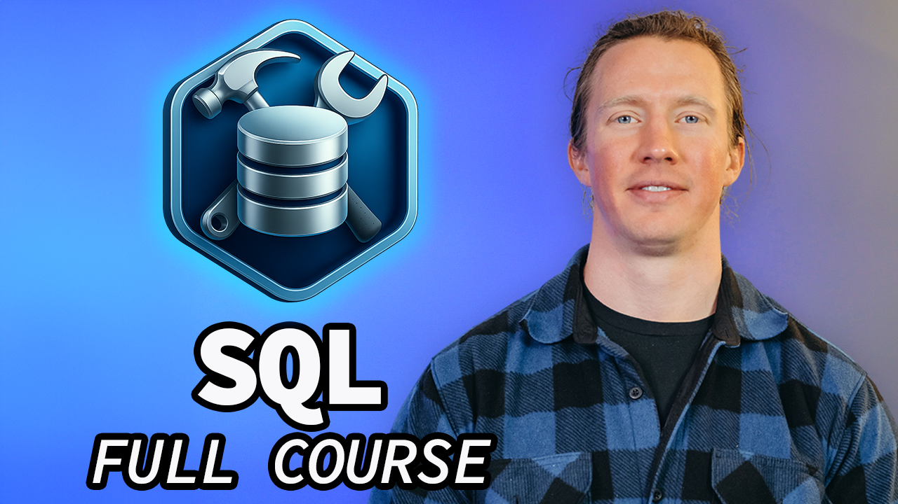
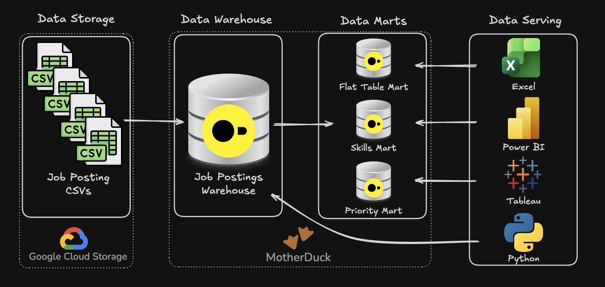

# SQL Data Engineering Projects

This repository documents my practical work with SQL and core Data Engineering concepts. It combines structured exercises with two completed portfolio projects: an exploratory analysis of the German Data Engineer job market and an end-to-end warehouse-and-mart build in DuckDB.

The work is based on concepts taught in Luke Barousse's [SQL for Data Engineering course](https://github.com/lukebarousse/SQL_Data_Engineering_Course), while the SQL implementations, project structure, documentation, and analytical interpretation in this repository reflect my own project work.

[](https://youtu.be/UjhFbq4uU2Y)

## Repository Overview

| Area | Status | Focus |
|---|---|---|
| [SQL foundations and practice problems](./1_Basics_and_PracticeProblems/) | Ongoing learning archive | SQL syntax, joins, modeling, DDL/DML, transactions, incremental loading, and analytical patterns |
| [Project 2.1: EDA with SQL](./2_Projects/2.1_EDA_with_SQL/) | Completed | German Data Engineer job-market analysis covering demand, salary, and skill prioritization |
| [Project 2.2: Building a Data Warehouse](./2_Projects/2.2_Building_DWH/) | Completed | Warehouse creation, cloud CSV loading, analytical marts, validation, and `MERGE`-based snapshot synchronization |

Only work that is present in the repository is listed as implemented. Potential follow-up projects are identified separately in the [Future Extensions](#future-extensions) section.

## Project Architecture



The principal engineering workflow in Project 2.2 moves through four layers:

1. job-posting CSV files stored in Google Cloud Storage;
2. a DuckDB or MotherDuck warehouse containing a fact table, dimensions, and a job-skill bridge;
3. three purpose-specific data marts for flat exploration, monthly skill demand, and priority-role tracking; and
4. potential analytical consumption through SQL clients, Excel, Power BI, Tableau, or Python.

The repository contains the SQL build logic for the warehouse and the three marts. The serving tools shown in the diagram represent possible consumers; their configuration is outside the current implementation scope.

## Projects

### Project 2.1 — EDA with SQL

[Open the complete project documentation](./2_Projects/2.1_EDA_with_SQL/)


This project analyzes the German Data Engineer job market using a relational job-posting dataset. Three SQL analyses examine the most frequently requested skills, skills associated with the highest median salaries, and skills offering the strongest observed balance between salary and demand.

The project demonstrates multi-table joins, aggregation, median-based salary analysis, calculated ranking metrics, sample-aware interpretation, and reproducible documentation.

### Project 2.2 — Building a Data Warehouse and Data Marts

[Open the complete project documentation](./2_Projects/2.2_Building_DWH/)


This project builds a complete SQL pipeline that:

- creates a normalized job-postings warehouse;
- loads four CSV sources directly from Google Cloud Storage;
- produces a denormalized Flat Mart;
- builds a dimensional monthly Skills Mart with additive measures;
- creates a Priority Mart with an initial snapshot; and
- synchronizes that snapshot through a DuckDB `MERGE` statement covering updates, inserts, and source-driven deletions.

The individual build scripts are orchestrated through [`Marts_Build_Pipeline.sql`](./2_Projects/2.2_Building_DWH/Marts_Build_Pipeline.sql).

## Technical Skills Demonstrated

- **SQL and relational modeling:** primary keys, foreign keys, fact tables, dimensions, and bridge tables
- **ETL/ELT workflow design:** remote CSV ingestion, explicit column mapping, transformations, and downstream mart creation
- **Analytical mart design:** denormalized access, dimensional aggregation, clearly defined grain, and additive measures
- **Advanced DuckDB SQL:** `read_csv`, CTAS, `ARRAY_AGG`, `STRUCT_PACK`, CTEs, `DATE_TRUNC`, `EXTRACT`, and `MERGE`
- **Data synchronization:** snapshot updates using matched, unmatched, and not-matched-by-source branches
- **Validation:** row-count checks, sample queries, and step-specific inspection output
- **CLI orchestration:** ordered execution of dependent SQL files through DuckDB `.read` commands

## Tech Stack

- **DuckDB** — local analytical database and SQL execution engine
- **MotherDuck** — optional cloud-hosted DuckDB execution target
- **SQL** — DDL, DML, transformations, aggregation, and synchronization logic
- **Google Cloud Storage** — source location of the job-posting CSV files
- **VS Code and DuckDB CLI** — development and execution environment
- **Git and GitHub** — version control and portfolio documentation

## Repository Structure

```text
SQL_Data_Engineering_Projects/
├── 1_Basics_and_PracticeProblems/
│   └── ...
├── 2_Projects/
│   ├── README.md
│   ├── 2.1_EDA_with_SQL/
│   └── 2.2_Building_DWH/
│       ├── 01_Table_Creation_DWH.sql
│       ├── 02_Schema_Load_DWH.sql
│       ├── 03_Flat_Mart_Creation_DWH.sql
│       ├── 04_Skills_Mart_Creation_DWH.sql
│       ├── 05_Priority_Mart_Creation_DWH.sql
│       ├── 05b_Priority_Roles_Updates_DWH.sql
│       ├── 06_Priority_Mart_Update_DWH.sql
│       ├── Marts_Build_Pipeline.sql
│       └── README.md
├── Images/
└── README.md
```

## Running Project 2.2

### Prerequisites

- DuckDB CLI installed and available in the terminal
- an internet connection for reading the source CSV files from Google Cloud Storage
- the repository cloned locally

### Local DuckDB execution

Run the master file from inside the Project 2.2 directory because its `.read` commands use relative paths:

```bash
git clone https://github.com/fallerdavid98-ai/SQL_Data_Engineering_Projects.git
cd SQL_Data_Engineering_Projects/2_Projects/2.2_Building_DWH
duckdb dw_marts.duckdb -c ".read Marts_Build_Pipeline.sql"
```

This creates or rebuilds the warehouse and all currently implemented marts in `dw_marts.duckdb`.

### Optional MotherDuck execution

The pipeline can also be executed against a MotherDuck database:

```text
duckdb md:
CREATE DATABASE dw_marts;
.exit
duckdb md:dw_marts ".read Marts_Build_Pipeline.sql"
```

See the [Project 2.2 README](./2_Projects/2.2_Building_DWH/) for the execution order, object-level documentation, validation logic, and operational limitations.

## Scope and Limitations

- The warehouse and analytical marts are portfolio implementations using the supplied job-posting dataset; they are not connected to a production scheduler or monitoring platform.
- The pipeline performs a full rebuild of the warehouse and most mart objects. Incremental behavior is demonstrated specifically by the Priority Mart snapshot.
- `05b_Priority_Roles_Updates_DWH.sql` supplies controlled role changes for testing the subsequent `MERGE`; it is not intended as a production method for maintaining reference data.
- The architecture diagrams provide conceptual context. The SQL files are the authoritative source for the exact implemented columns and object names.
- The repository does not currently contain a Company Mart implementation or a Project 3 directory.

## Future Extensions

The following ideas are optional roadmap items and are **not implemented in the current repository**:

- a separate Project 3, covering a flat-source-to-warehouse transformation;
- an additional Company Mart for company-level hiring trends; and
- automated scheduling, logging, failure handling, and formal data-quality tests around the SQL pipeline.

These items will only be promoted into the main project overview after reviewable implementation files are available.

## Acknowledgement

The repository was developed while working through Luke Barousse's [SQL for Data Engineering course](https://github.com/lukebarousse/SQL_Data_Engineering_Course). The course repository provides the learning context and structural inspiration; this repository documents my own implementations, adaptations, and project-specific findings.

